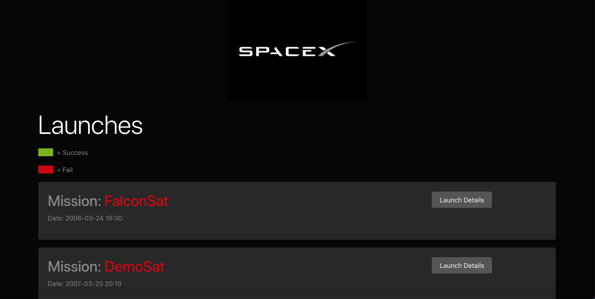
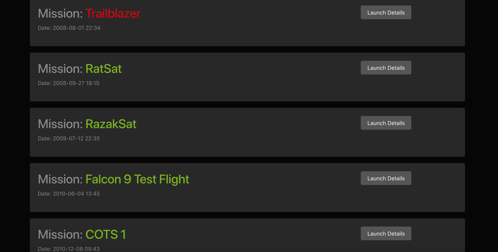
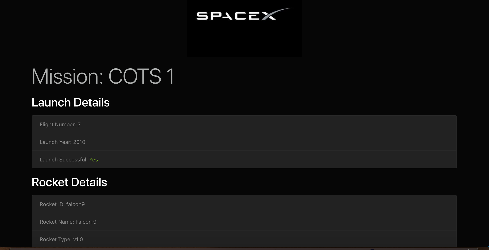
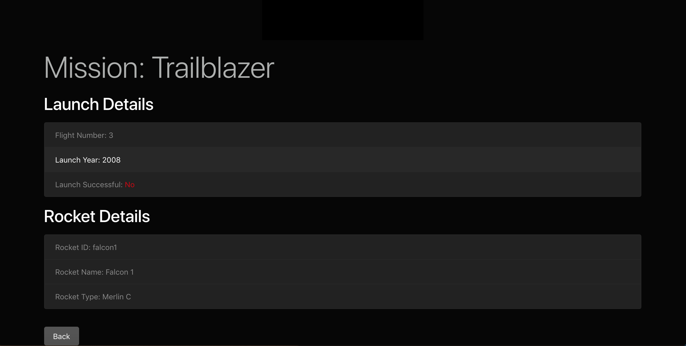

# Spacex-Launch-Details
This web application shows SpaceX Rocket Launch Details. It uses React, GraphQL and Apollo. This web application shows detailed information of SpaceX and their Rockets. I used the SpaceX api for the data.

